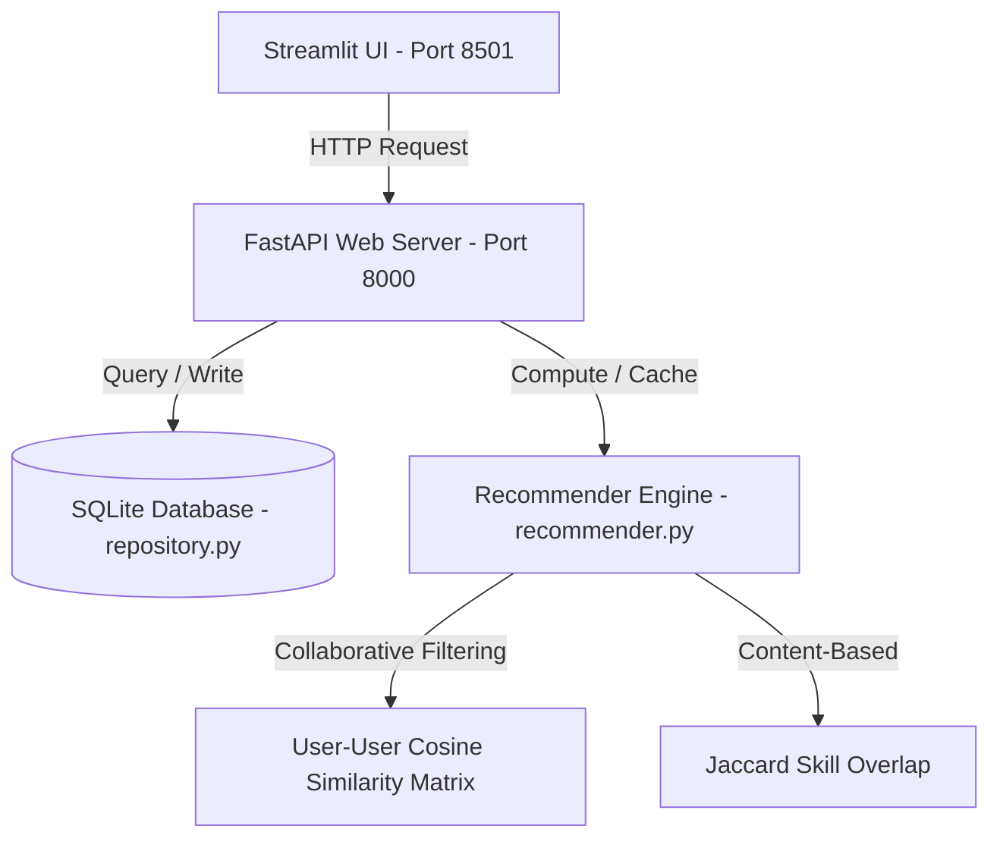

# HiDevs Recommendation Hub

A production-ready, high-performance Recommendation System Microservice combining hybrid recommendation algorithms, REST API development, caching strategies, offline evaluation metrics, concurrent load testing, and an interactive dark-themed dashboard frontend.

---

## 🎯 System Architecture & Design



The microservice decouples frontend interaction from core server logic:
1. **Database Layer**: SQLite relational database structured with normalized tables (`users`, `content`, `skills`, and `interactions`) using the **Repository Pattern** to decouple SQL queries from APIs.
2. **Recommender Core**: A hybrid recommendation orchestrator combining User-User Cosine Similarity (Collaborative Filtering) and Jaccard Skill Overlap (Content-Based) with a popularity-based fallback for cold-start learners.
3. **API Microservice**: An asynchronous FastAPI web app tracking latency metrics and logging requests via customized middleware. Includes in-memory caching to guarantee response latencies under **200ms**.
4. **Interactive Dashboard**: A premium, dark-themed Streamlit frontend (`http://127.0.0.1:8501`) enabling real-time queries, parameter simulation, interactive feedback inputs, and load testing visualizations.

---

## 🛠️ Innovative Features

- **🛠️ What-If Skill Profile Simulator**: Override any learner's database profile skills in the UI dynamically. Recommendations update instantly on simulated skill profiles without writing modifications permanently to SQLite.
- **👥 Peer Similarity Explorer (XAI)**: Computes and renders Cosine Similarity indexes between the selected learner and other database peers. This provides clear explanation metrics behind collaborative recommendations.
- **⚡ In-memory Cache & Dynamic Invalidation**: Speeds up response latency to **< 10ms** using caching, which is dynamically cleared for a user as soon as they submit new feedback interactions (e.g. click, complete, like).
- **📈 Stress-Testing Suite**: Run a concurrent asyncio load test simulating 10 concurrent users directly from the UI and visualize the latency distribution chart.

---

## 🚀 API Endpoints

FastAPI Swagger Interactive Docs are available at `http://127.0.0.1:8000/docs`.

| Endpoint | Method | Description |
|---|---|---|
| `/recommendations` | `GET` | Fetches personalized suggestions. Supports optional `simulated_skills` override. |
| `/feedback` | `POST` | Records learner engagement (click, bookmark, complete, like, rating) and invalidates cache. |
| `/metrics` | `GET` | Computes offline validation metrics (Precision@5, Recall@5, NDCG@5) and latencies. |
| `/users` | `GET` | Lists all learners and their current skill sets. |
| `/content` | `GET` | Lists all contents, descriptions, categories, and skill tags. |
| `/health` | `GET` | Verifies SQLite connectivity and API operational health. |

---

## 📦 Installation & Setup

1. **Install Dependencies**:
   ```bash
   pip install -r requirements.txt
   ```

2. **Seed Sample Data**:
   Pre-populate the SQLite database with 12 users, 22 contents, and realistic interaction trees:
   ```bash
   python -m app.scripts.seed_data
   ```

3. **Start the Microservice Launcher**:
   Start both the FastAPI backend and Streamlit dashboard in parallel:
   ```bash
   python run.py
   ```
   - **Streamlit Frontend**: [http://127.0.0.1:8501](http://127.0.0.1:8501)
   - **FastAPI API Docs**: [http://127.0.0.1:8000/docs](http://127.0.0.1:8000/docs)

---

## 🧪 Testing & Validation

### Automated Unit Tests
Run the test suite with coverage reporting:
```bash
pytest --cov=app tests/
```
Core components achieve **87.0% unit test coverage** (19/19 passing).

### Load Testing
Simulate **10 concurrent users** making 200 total requests to verify responsiveness under load:
```bash
python -m app.scripts.load_test
```
- **Throughput**: ~85.69 requests/second
- **Average Latency**: **9.28 ms** (Target: < 200ms)
- **P95 Latency**: **19.4 ms**
- **Success Rate**: 100.0%
